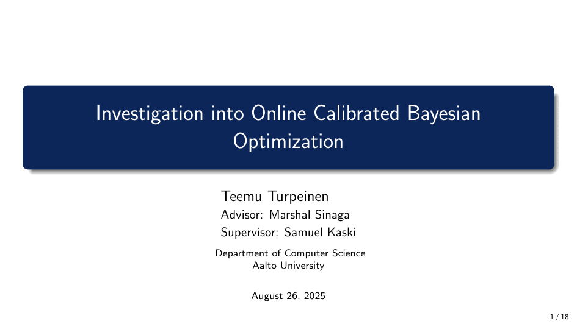

# Experimental Investigation of Online Calibrated Bayesian Optimization

This repository contains the code for an experimental framework to investigate and analyze methods for Online Calibrated Bayesian Optimization.

---

## Motivation

Bayesian Optimization (BO) is a powerful technique for optimizing expensive black-box functions. However, its performance heavily relies on the quality of the surrogate model's uncertainty estimates. Poorly calibrated uncertainties can lead to inefficient exploration and suboptimal results.

This project was motivated by two recent papers:
1.  **Foldager et al. (2023)** raised important critiques about the role of model uncertainties in standard BO.
2.  **Deshpande et al. (2024)** introduced methods for *online calibration* to improve these uncertainty estimates during the optimization process.

This framework was built to investigate whether online calibration methods effectively address the issues raised, and to analyze the most important metrics for evaluating success in calibrated BO.

---

## Key Results & Presentation

The final presentation provides a comprehensive overview of the project's findings and conclusions.

**[➡️ View the full presentation slides here (PDF)](Docs/FinalPresentation.pdf)**

For a quick summary, the GIF below cycles through the key slides:



---

## Getting Started

Follow these instructions to set up the project and run experiments.

### **Local Setup (Recommended)**

For running on a local machine, we recommend using a standard Python virtual environment.

1.  **Clone the repository:**
    ```sh
    git clone [https://github.com/your-username/your-repo-name.git](https://github.com/your-username/your-repo-name.git)
    cd your-repo-name
    ```
2.  **Create and activate a virtual environment:**
    ```sh
    python3 -m venv venv
    source venv/bin/activate
    ```
3.  **Install dependencies:**
    ```sh
    pip install -r requirements.txt
    ```

### **Cluster/Conda Setup**

The `environment.yml` file is provided for users who prefer Conda, which is particularly useful on HPC clusters.

```sh
# Create and activate the conda environment
conda env create -f environment.yml
conda activate ocbo
```

---

## Usage

To run a single experiment, execute the `main.py` script from the root directory. All experiment parameters are passed as a single string, with each parameter separated by a `|`.

```sh
python3 -c "from main import *; run()" "seed=0|surrogate=GP|acquisition=EI|data_name=benchmark|problem_idx=11"
```

For examples of how to run sweeps over multiple seeds and configurations, see the `run_synthetic.sh` and `run_synthetic_specific.sh` for slurms scripts.

---

## Citation

This work builds directly upon the research from the following papers:

* Foldager, J., et al. (2023). "On the Role of Model Uncertainties in Bayesian Optimization."
* Deshpande, S., et al. (2024). "Online Calibrated and Conformal Prediction Improves Bayesian Optimization."

The base code structure was adapted from the official implementation for the Foldager et al. paper, available at [jfold/unibo](https://github.com/jfold/unibo).

---

## Acknowledgments

* Thanks to my advisor, Marshal Sinaga, for their guidance and support through this project.